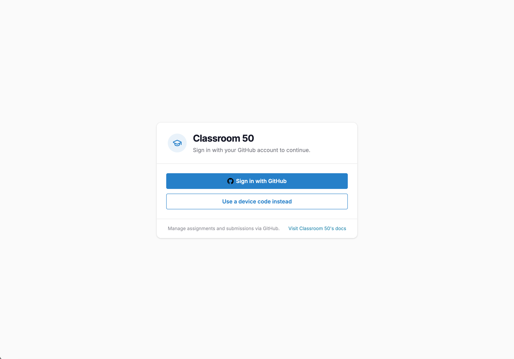
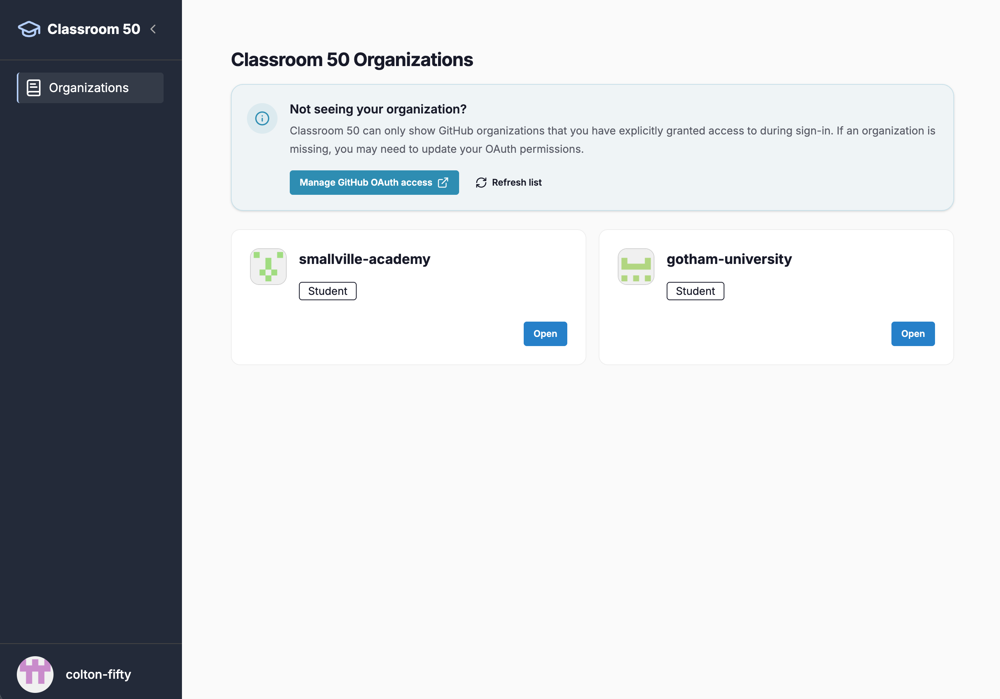
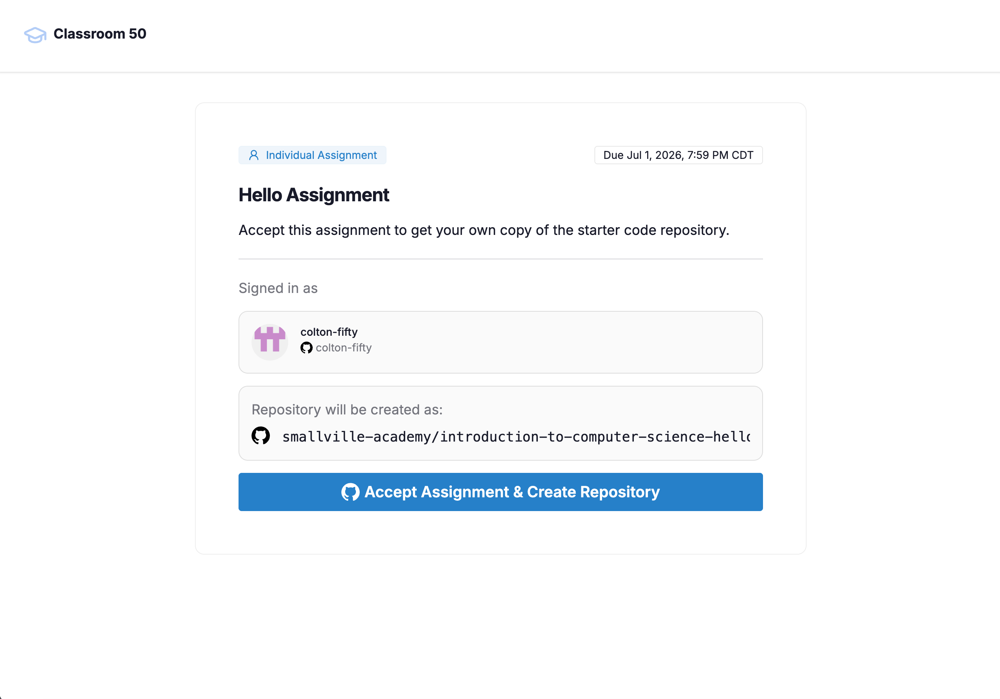
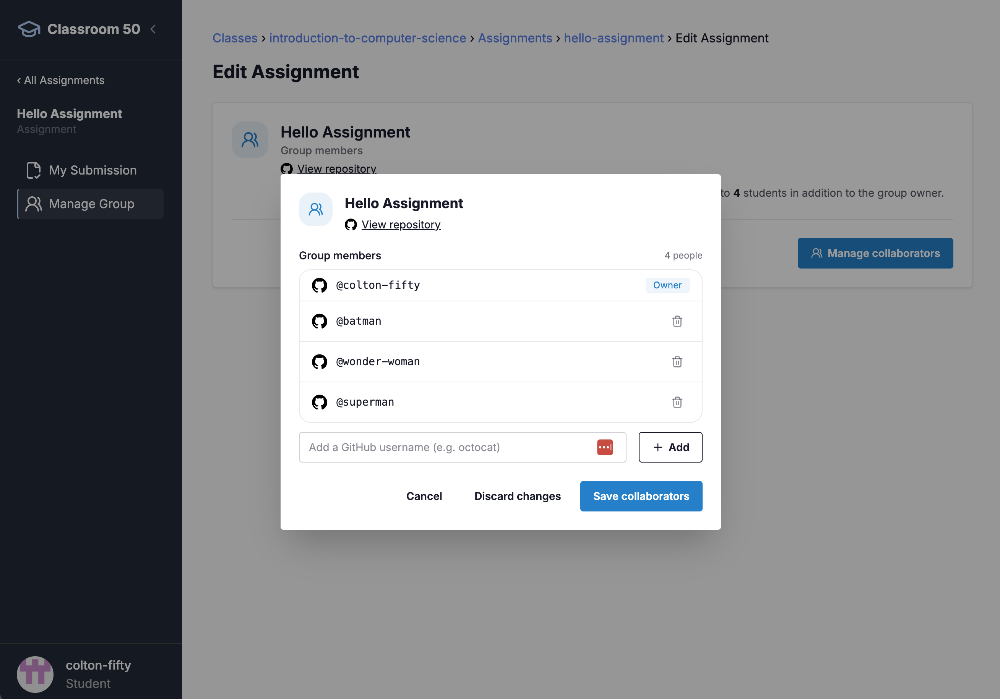
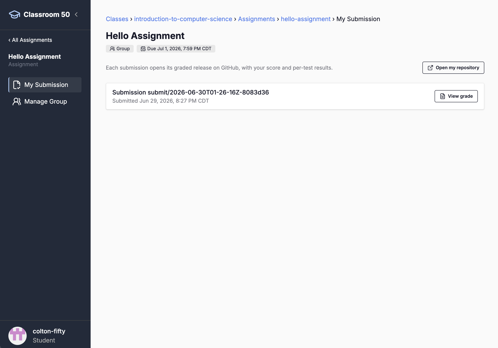
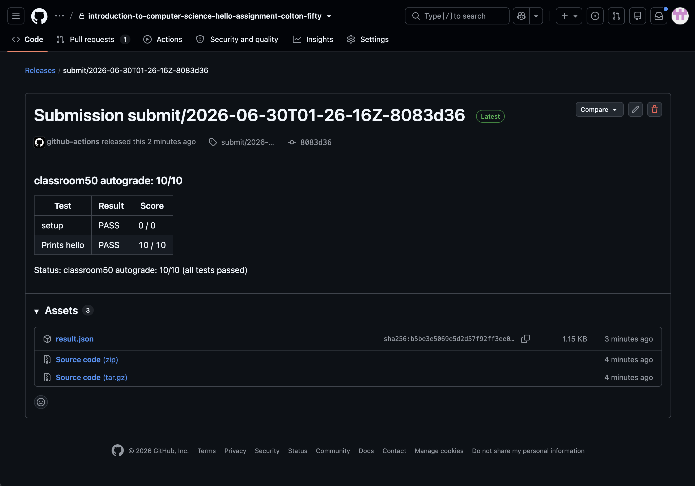

# Classroom50 graphical and command-line workflow

This guide shows both supported interfaces used in the course:

- **Classroom50 web app** for signing in, accepting an assignment, managing group collaborators, and opening submission information;
- **GitHub web interface** for repositories, Codespaces, Issues, pull requests, commits, Releases, and Feedback PRs;
- **terminal commands** for exact Git operations and explicit Classroom50 submission.

The browser path is shown first. The CLI is an equivalent path or a required final step where Classroom50 has no browser button.

> Interface reference: checked on 2026-08-29 against the official Classroom50 Web Student Guide and local `gh-student`/`gh-teacher` v1.25.1. The included reference screenshots come from the official Classroom50 wiki; compare them with the pilot classroom before production release.

## 1. Sign in

Open [classroom50.org](https://classroom50.org) and choose **Sign in with GitHub**.



When your teacher invited you to the GitHub organization, accept that invitation before using the browser assignment flow. The CLI alternative can accept a pending organization invitation while accepting the first assignment:

```bash
gh student accept VNU-HUS <classroom> <assignment>
```

## 2. Find the student organization and classroom

After signing in, open the organization card with the **Student** label. Then open the classroom and its assignments.



Some assignments remain link-only until their release time. In that case, use the exact assignment link shared by the instructor.

## 3. Accept an assignment

Open the assignment link and choose **Accept assignment**. Classroom50 creates or finds the assignment repository and then displays a link to it.



CLI equivalent:

```bash
gh student accept VNU-HUS <classroom> <assignment>
```

If Classroom50 reports that the assignment was already accepted, do not create another repository. Open the existing repository instead.

## 4. Add members to a group assignment

Only the founder accepts a group assignment. On the accepted assignment page, use the edit pencil and choose **Manage collaborators**. Add only the other enrolled group members. A one-person group adds nobody.



CLI equivalent:

```bash
gh student invite VNU-HUS/<shared-repository> <github-username>
```

The other members join the founder's repository; they do not accept the assignment separately.

## 5. Open and work in the GitHub repository

Follow the repository link shown by Classroom50. On GitHub, choose **Code → Codespaces → Create codespace on main**, or clone the repository locally.

Classroom50 creates and tracks assignment repositories. It does not edit files or create Git commits. Use GitHub's web tools, VS Code Source Control, GitHub Desktop, or ordinary Git commands for the actual work.

Typical terminal workflow:

```bash
git status
git diff
git add <files>
git commit -m "Describe the change"
git push
```

## 6. Submit a Week 0–7 assignment

The course's automatically checked assignments use **A tagged commit** submission mode. Ordinary pushes save work but do not create the official graded submission. After pushing the intended commit, run:

```bash
python3 check_submission.py
gh student submit
```

The current Classroom50 web app has no separate browser **Submit** button equivalent to this explicit tag submission.

## 7. View a weekly submission and completion result

Open the assignment in Classroom50 and choose **My submission**. The page shows whether and when a submission was recorded.



When autograding is enabled, choose **View grade**. Classroom50 opens the corresponding GitHub Release, where the score and per-check details are stored. The assignment's GitHub Feedback PR is the long-lived place for checklist feedback and discussion.



The course's weekly score is completion-only:

```text
100/100  complete submission
0/100    incomplete submission
```

It does not certify mathematical, logical, algorithmic, or factual correctness.

## 8. Important final-project difference

The final-examination project uses an empty, non-autograded Classroom50 repository. The browser still supports assignment acceptance, collaborator management, and opening the repository, but there is no meaningful **View grade** result and no Classroom50 submission button.

For that project, the authoritative proposal and final submissions are exact Git commit URLs posted in the group's existing class topic issue, as specified by its `Submission Guide.md`.

## 9. Common recovery steps

- **Wrong person accepted a group assignment:** stop before inviting others and contact the instructor; do not create more repositories.
- **Assignment already accepted:** open the existing repository.
- **Organization or classroom is missing:** verify the GitHub organization invitation and sign-in authorization.
- **Cannot add a collaborator:** verify that the account is an enrolled member of the same classroom and that the group limit is not exceeded.
- **Wrong remote repository:** inspect `git remote -v` before pushing.
- **No result after `git push`:** for the course's tag-only weekly assignments, run `gh student submit` after pushing.
- **No View grade link yet:** wait for the GitHub Actions run to finish, refresh **My submission**, and inspect the repository's Actions or Releases page.

## Screenshot provenance

See [`images/SOURCES.md`](images/SOURCES.md). Text instructions are authoritative; screenshots are visual aids and may change when Classroom50 updates its interface.
